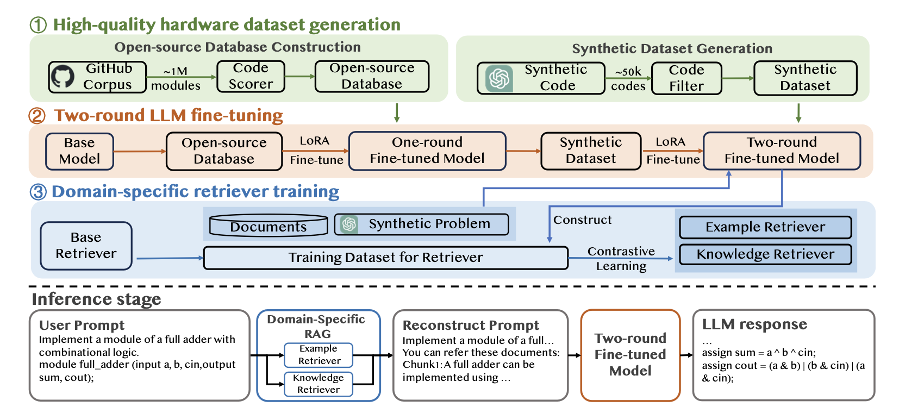

# AutoVCoder

## Introduction

AutoVCoder is a systematic open-source framework designed to significantly improve the correctness of large language models (LLMs) in generating Verilog code, while also enhancing the quality of their output. The framework integrates three novel techniques, including a high-quality hardware dataset generation approach, a two-round LLM fine-tuning method, and a domain-specific retrieval-augmented generation (RAG) mechanism.

- **High-Quality Hardware Dataset Generation**: Enhances model training by generating high-quality datasets.
- **Two-Round LLM Fine-Tuning**: Further improves the model's generation capabilities through a two-round fine-tuning process.
- **Domain-Specific RAG Mechanism**: Utilizes retrieval-augmented generation to improve the quality of Verilog code generation.

Experimental results demonstrate that AutoVCoder outperforms both industrial and academic LLMs in Verilog code generation.
 
Our paper, "AutoVCoder: A Systematic Framework for Automated Verilog Code Generation using LLMs" is presented at ICCD '24. Please refer to our paper for more details:

```bibtex
@inproceedings{autovcoder,
  author    = {Mingzhe Gao and Jieru Zhao and Zhe Lin and Wenchao Ding and Xiaofeng Hou and Yu Feng and Chao Li and Minyi Guo},
  title     = {AutoVCoder: A Systematic Framework for Automated Verilog Code Generation using LLMs},
  journal   = {IEEE International Conference on Computer Design, ICCD},
  year      = {2024},
}
```

## Overview



The picture shows our framework, which includes three key components: 1) generating a high-quality hardware dataset, 2) a two-round fine-tuning process for LLMs, and 3) a domain-specific retriever training mechanism for RAG.
We collect Verilog designs from GitHub and use a scoring system to filter out low-quality code. The refined dataset is used for the first round of LLM fine-tuning to teach Verilog syntax and design principles. For the second round, we create a synthetic dataset using ChatGPT-3.5 and a verification process to ensure code correctness.
Finally, we enhance Verilog code generation with RAG by training domain-specific retrievers using contrastive learning, which helps fetch relevant examples and knowledge.

## Requirement

You can install the required packages for running this project using:

```
pip3 install --upgrade pip
pip3 install -r requirements.txt
```

## Project File Tree

The project file structure is as below:

```
.
├── data
│   ├── first_round        
│   │   └── dataset        # dataset for first round
│   ├── second_round       
│   │   └── dataset        # dataset for second round
│   └── rag                
│       └── dataset        # dataset for RAG
├── src
│   ├── first_round        
│   │   ├── build_dataset  # Build dataset for first round
│   │   └── code_scorer    # Code scorer for first round
│   │   └── train          # Train model for first round
│   ├── second_round       
│   │   ├── build_dataset  # Build dataset for second round
│   │   └── code_filter    # Code filter for second round
│   │   └── train          # Train model for second round
│   └── rag                # RAG dataset
│       ├── build_dataset  # Build dataset for RAG
│       └── train          # Train model for retriever
├── downloads
│   ├── download.py        # Script for download models
├── tests
│   ├── rtllm              # RTLLM benchmark
│   └── verilog-eval       # verilog-eval benchmark
│   └── test.py            # Script for testing the model
├── requirements.txt       # List of project dependencies
```


## License

This project is licensed under the MIT License - see the [LICENSE](LICENSE) file for details.

## Contact

For any questions or suggestions, please contact us via [GitHub Issues](https://github.com/sjtu-zhao-lab/AutoVCoder/issues).
